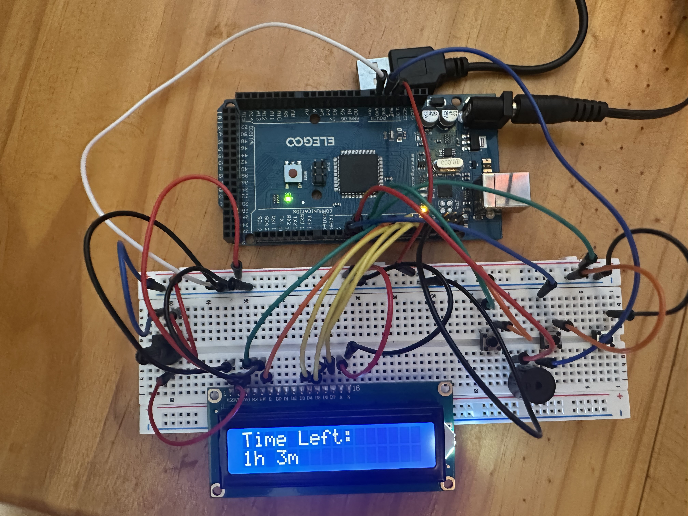
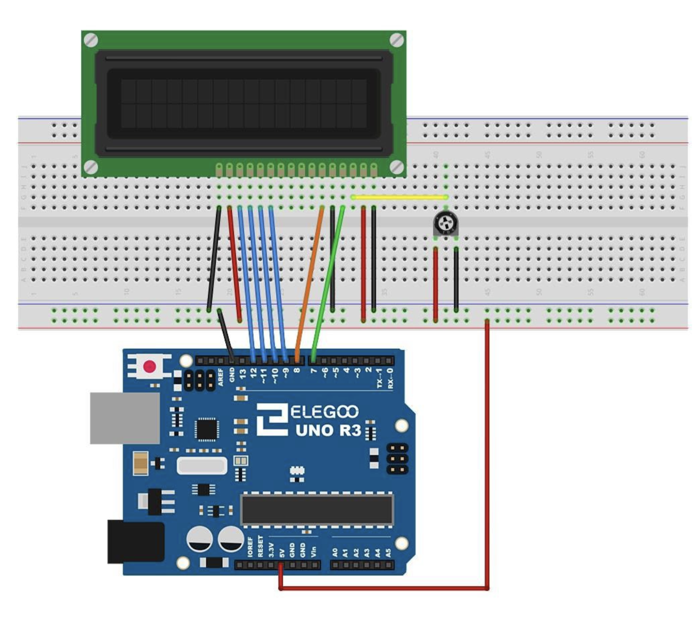

# Arduino Morse Code Display

This project uses an Arduino Mega to take input from a push button and display Morse code (dots and dashes) on a 16x2 I2C LCD screen. A short press on the button creates a "dot" (.), and a long press creates a "dash" (-).

## Components & Estimated Cost

| Component            | Quantity | Estimated Cost (USD) |
|-----------------------|----------|-----------------------|
| Arduino Mega          | 1        | $30 - $40            |
| 16x2 I2C LCD Display  | 1        | $5 - $10             |
| Push Button           | 1        | < $1                 |
| 10kΩ Potentiometer    | 1        | < $1                 |
| Breadboard            | 1        | $5                   |
| Jumper Wires          | Pack     | $5                   |
| **Total**             |          | **~$46 - $62**       |

*Note: Prices are estimates and may vary based on the supplier.*

## Wiring

Connect the components as follows:

### LCD Display:
VSS → GND
VDD → 5V
VO  → Middle pin of 10K potentiometer (for contrast)
RS  → Digital 7
RW  → GND
E   → Digital 8
D4  → Digital 9
D5  → Digital 10
D6  → Digital 11
D7  → Digital 12
A   → 5V (backlight power)
K   → GND (backlight ground)

### Potentiometer:
- Connect the outer pins to 5V and GND.
- Connect the middle pin to the LCD's contrast pin (VO).

### Button:
- One leg to Arduino Mega pin 6.
- The other leg to GND.

### Additional Notes:
- Use jumper wires to connect the components on the breadboard.
- Adjust the potentiometer to set the contrast of the LCD.

## How It Works

1. When the button is pressed, the Arduino records the press duration.
2. A short press (≤ 250 ms) is interpreted as a "dot" (.) and displayed on the LCD.
3. A long press (> 250 ms) is interpreted as a "dash" (-) and displayed on the LCD.
4. The cursor advances after each input. If the line is full, the display clears for new input.

## Photos

### Wiring Setup

### Circuit Diagram

## License

This project is open-source and can be used freely for educational purposes.